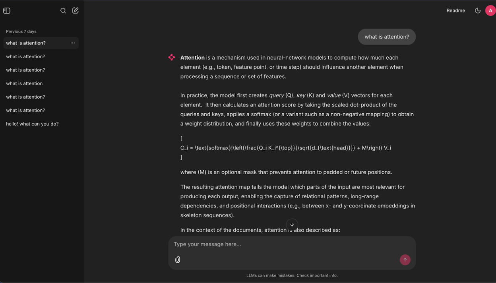
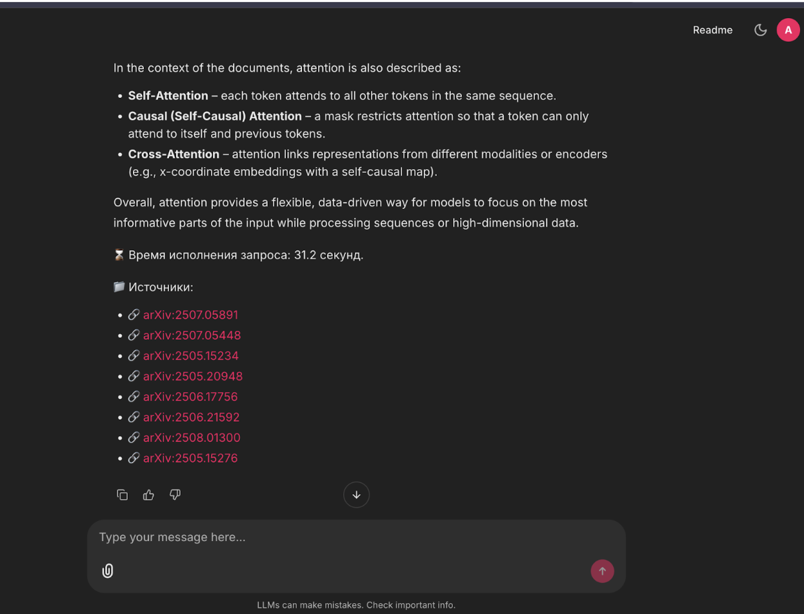

# Science RAG: Система поиска и ответов на вопросы по научным статьям

Science RAG — это система на основе Retrieval-Augmented Generation (RAG) для работы с научными статьями по Computer Science из arXiv. Система позволяет задавать вопросы на естественном языке и получать ответы на основе релевантных фрагментов из научных публикаций.

## 🎯 Описание проекта

Science RAG объединяет:

- **Сбор данных**: Автоматическая загрузка научных статей из arXiv
- **Обработка документов**: Извлечение текста из PDF, разбиение на фрагменты (chunks) и предобработка
- **Векторные эмбеддинги**: Семантические представления для поиска по сходству
- **База данных**: PostgreSQL с расширением pgvector для векторного поиска
- **LLM интеграция**: Генерация ответов с использованием контекста из найденных документов

Система позволяет исследователям задавать вопросы на естественном языке и получать точные ответы, основанные на исходных научных публикациях.

## ✨ Основные возможности

- **Масштабируемый пайплайн данных**: Пакетная обработка с асинхронной загрузкой PDF
- **Интеллектуальное разбиение**: Разделение документов с учетом семантических границ
- **Векторная база данных**: Хранение векторов в PostgreSQL для семантического поиска
- **Гибридный поиск**: Комбинация векторного поиска (cosine similarity) и BM25 для лучших результатов
- **Веб-интерфейс**: Удобный интерфейс на базе Chainlit для взаимодействия с системой
- **История диалогов**: Сохранение контекста разговора для более точных ответов

## 📋 Необходимые инструменты

Для запуска проекта вам понадобятся:

- **Python 3.10+**
- **[UV](https://docs.astral.sh/uv/)** — современный менеджер пакетов Python
- **PostgreSQL 16+** с расширением **pgvector**
- **Docker & Docker Compose** (опционально, для упрощенного развертывания)
- **Ollama** — для запуска LLM модели локально
- **16GB+ RAM** (рекомендуется для работы с моделями)
- **CUDA-совместимая GPU** (опционально, для ускорения инференса)

## 🚀 Способы запуска

### Вариант 1: Запуск через Docker Compose (рекомендуется)

Самый простой способ запустить все компоненты системы:

```bash
# 1. Создайте файл .env на основе примера
./setup-env.sh

# Добавьте в .env переменную для Ollama:
# OLLAMA_BASE_URL=http://host.docker.internal:11434  # для Docker
# или
# OLLAMA_BASE_URL=http://localhost:11434  # для локального запуска

# 2. Убедитесь, что Ollama запущен и модель загружена
# ollama pull llama3.2  # или другая модель

# 3. Запустите все сервисы
docker-compose up -d

# 4. Просмотрите логи
docker-compose logs -f app

# 5. Откройте браузер и перейдите на http://localhost:8000
```

### Вариант 2: Локальный запуск

Для разработки и отладки:

```bash
# 1. Установите зависимости
uv sync

# 2. Настройте окружение
./setup-env.sh

# 3. Убедитесь, что PostgreSQL запущен с расширением pgvector
# Создайте базу данных и выполните:
# CREATE EXTENSION vector;

# 4. Запустите Ollama (если еще не запущен)
ollama serve

# 5. Загрузите модель для LLM
ollama pull llama3.2  # или другая модель

# 6. Добавьте в .env:
# OLLAMA_BASE_URL=http://localhost:11434

# 7. Запустите приложение
uv run chainlit run app/app.py --host 0.0.0.0 --port 8000
```

### Подготовка данных

Перед использованием системы необходимо загрузить и обработать данные:

```bash
# Этап 1: Загрузка метаданных и PDF статей из arXiv
python scripts/download_arxiv_pdfs.py

# Этап 2: Обработка PDF и создание chunks с эмбеддингами
python scripts/pdf_to_chunks.py
```

## 💡 Примеры использования


### UI




### Пример 1: Вопрос о конкретной технологии

**Вопрос:**
```
Что такое attention mechanism в трансформерах?
```

**Ответ системы:**
Система найдет релевантные фрагменты из статей о трансформерах и attention механизмах, и сгенерирует ответ на основе найденного контекста, указав источники.

### Пример 2: Сравнение подходов

**Вопрос:**
```
В чем разница между supervised и unsupervised learning?
```

**Ответ системы:**
Система найдет статьи, описывающие оба подхода, и предоставит сравнительный анализ с ссылками на конкретные публикации.

### Пример 3: Вопрос с контекстом диалога

**Вопрос 1:**
```
Расскажи про нейронные сети
```

**Вопрос 2 (в том же диалоге):**
```
А какие архитектуры самые популярные?
```

Система использует историю диалога для понимания, что речь идет о нейронных сетях, и найдет информацию о популярных архитектурах.

### Пример 4: Технический вопрос

**Вопрос:**
```
Как работает backpropagation в глубоких нейронных сетях?
```

**Ответ системы:**
Система найдет технические описания алгоритма обратного распространения ошибки и объяснит его работу с математическими деталями из исходных статей.

## 📂 Структура проекта

```
app/
├── app/
│   ├── app.py              # Основное приложение Chainlit
│   ├── users.py            # Управление пользователями
│   └── src/
│       ├── db/
│       │   └── scheme.py   # Модели базы данных
│       └── processing/
│           ├── download_arxiv.py  # Загрузка статей из arXiv
│           └── pdf.py             # Обработка PDF
├── scripts/
│   ├── download_arxiv_pdfs.py     # Скрипт загрузки PDF
│   ├── pdf_to_chunks.py           # Скрипт обработки в chunks
│   └── download_models.py         # Скрипт загрузки моделей
├── data/
│   └── large/                     # Данные и PDF файлы
├── models/                        # Локальные модели
├── docker-compose.yaml
├── Dockerfile
├── pyproject.toml
└── README.md
```

## 🏗️ Архитектура RAG-системы

Science RAG представляет собой многокомпонентную систему с классической RAG-архитектурой, состоящую из трех основных этапов: **подготовка данных**, **хранение** и **запрос-ответ**.

### Общая схема системы

```
┌─────────────────────────────────────────────────────────────────┐
│                    ЭТАП 1: Подготовка данных                     │
├─────────────────────────────────────────────────────────────────┤
│  arXiv API → PDF файлы → Docling → Текст → Chunks → Embeddings  │
└─────────────────────────────────────────────────────────────────┘
                              ↓
┌─────────────────────────────────────────────────────────────────┐
│                    ЭТАП 2: Хранение                              │
├─────────────────────────────────────────────────────────────────┤
│         PostgreSQL + pgvector (векторы + метаданные)            │
│                     + Full-text search (BM25)                    │
└─────────────────────────────────────────────────────────────────┘
                              ↓
┌─────────────────────────────────────────────────────────────────┐
│                    ЭТАП 3: Запрос-Ответ                          │
├─────────────────────────────────────────────────────────────────┤
│  Вопрос → Рефразирование → Гибридный поиск → LLM → Ответ        │
│              (история)      (Vector + BM25)    (Ollama)          │
└─────────────────────────────────────────────────────────────────┘
```

### Компоненты системы

#### 1. **Data Pipeline (Подготовка данных)**

**Загрузка документов** (`scripts/download_arxiv_pdfs.py`):
- Получение метаданных статей из arXiv API
- Пакетная загрузка PDF (батчами по 200 с задержкой 1 сек)
- Фильтрация по категориям Computer Science
- Сохранение в Parquet для эффективного хранения метаданных

**Обработка PDF** (`src/processing/pdf.py`):
- **Docling** — продвинутый конвертер PDF с поддержкой:
  - Извлечение текста с сохранением структуры
  - Распознавание таблиц (table structure matching)
  - Обработка математических формул (formula enrichment)
  - Описание изображений через vision models
- Разбиение на chunks (размер 1500 символов, overlap 200)
- Генерация эмбеддингов через **multilingual-e5-large**

**Векторизация**:
- Модель: `intfloat/multilingual-e5-large`
- Префиксы: `"passage: "` для документов, `"query: "` для запросов
- Average pooling с нормализацией (L2)
- Максимальная длина: 512 токенов

#### 2. **Storage Layer (База данных)**

**PostgreSQL 16 + pgvector**:

Таблицы:
- `documents` — chunks с эмбеддингами и контентом
  ```sql
  - arxiv_id (идентификатор статьи)
  - chunk_id (номер фрагмента)
  - content (текст)
  - embedding (вектор 1024 измерений)
  - metadata (JSONB)
  ```
- `documents_meta` — метаданные статей
  ```sql
  - arxiv_id, paper_name, pub_year
  - main_category, subcategory
  ```
- `chat_history` — история диалогов
- `users` — пользователи и аутентификация

**Индексы**:
- Vector similarity index (pgvector `<->` operator)
- Full-text search index (PostgreSQL tsvector)

#### 3. **Retrieval Pipeline (Поиск)**

**Гибридный поиск** с Reciprocal Rank Fusion (RRF):

1. **Vector Search** (cosine similarity):
   - Эмбеддинг запроса через multilingual-e5-large
   - Поиск TOP-K*2 ближайших векторов
   - Оператор `<->` для cosine distance

2. **BM25 Search** (full-text):
   - PostgreSQL `ts_rank_cd` для текстового поиска
   - Query expansion с `plainto_tsquery`
   - TOP-K*2 релевантных документов

3. **RRF Fusion**:
   - Объединение результатов обоих методов
   - Формула: `score = 1 / (k + rank + 1)`, где k=60
   - Финальный TOP-K после ранжирования

**Рефразирование запроса**:
- При наличии истории диалога LLM рефразирует вопрос
- Сохраняет контекст предыдущих сообщений
- Делает запрос самодостаточным для поиска

#### 4. **Generation Pipeline (Генерация ответов)**

**LLM интеграция** (Ollama):
- Модель: `gpt-oss:120b` (или другая через Ollama)
- System prompt с инструкциями:
  - Отвечать только на основе контекста
  - Не придумывать информацию
  - Указывать источники

**Промпт-инжиниринг**:
```
DOCUMENT CONTEXT: [релевантные chunks]
CHAT HISTORY: [предыдущие сообщения]
QUESTION: [текущий вопрос]
ANSWER: [генерация]
```

#### 5. **User Interface (Веб-интерфейс)**

**Chainlit Framework**:
- Интерактивный чат-интерфейс
- Аутентификация пользователей (password-based)
- История диалогов с персистентностью
- Асинхронная обработка запросов
- Индикация прогресса (рефразирование → поиск → генерация)
- Отображение источников с ссылками на arXiv

**Управление сессиями**:
- SQLAlchemy Data Layer для хранения диалогов
- Thread-based история чатов
- Кэширование контекста пользователя

### Технологический стек

| Компонент | Технология |
|-----------|-----------|
| **Backend** | Python 3.10+, asyncio |
| **Web Framework** | Chainlit |
| **Database** | PostgreSQL 16 + pgvector |
| **Vector Search** | pgvector (cosine similarity) |
| **Text Search** | PostgreSQL full-text search (BM25) |
| **Embedding Model** | multilingual-e5-large (1024d) |
| **PDF Processing** | Docling |
| **LLM** | Ollama (gpt-oss:120b) |
| **Deployment** | Docker Compose |
| **Package Manager** | UV |
| **Testing** | DeepEval |

### Поток обработки запроса

```
1. Пользователь → Вопрос
   ↓
2. Загрузка истории диалога (thread_id)
   ↓
3. Рефразирование вопроса (если есть история)
   ↓ LLM (Ollama)
   ↓
4. Гибридный поиск
   ↓ Векторный поиск (pgvector)
   ↓ + BM25 (PostgreSQL)
   ↓ → RRF Fusion
   ↓
5. TOP-K релевантных chunks
   ↓
6. Генерация ответа
   ↓ LLM (Ollama) + контекст + история
   ↓
7. Форматирование ответа
   ↓ + ссылки на источники (arXiv)
   ↓ + время выполнения
   ↓
8. Сохранение в историю
   ↓
9. Отображение пользователю
```

### Особенности реализации

**Оптимизация производительности**:
- Семафор для контроля параллельных LLM-запросов
- Асинхронное выполнение задач с индикацией прогресса
- Кэширование GPU памяти (torch.cuda.empty_cache)
- Батчинг при обработке больших объемов данных

**Масштабируемость**:
- Векторный поиск через pgvector с индексами
- Возможность горизонтального масштабирования БД
- Stateless архитектура приложения
- Docker-контейнеризация

**Надежность**:
- Retry механизмы при оценке метрик
- Обработка ошибок с graceful degradation
- Health checks для сервисов
- Логирование всех операций

## 🔧 Конфигурация

Основные параметры настраиваются через переменные окружения в файле `.env`:

- `POSTGRES_HOST`, `POSTGRES_DB`, `POSTGRES_USER`, `POSTGRES_PASSWORD` — параметры подключения к БД
- `OLLAMA_BASE_URL` — URL для подключения к Ollama
- `TOP_K` — количество релевантных chunks для поиска (по умолчанию 9)
- `MAX_LENGTH` — максимальная длина текста для эмбеддинга (по умолчанию 512)

## 🔍 Как это работает

1. **Поиск релевантных документов**: При получении вопроса система:
   - Создает эмбеддинг запроса с помощью модели `multilingual-e5-small`
   - Выполняет векторный поиск (cosine similarity) в базе данных
   - Выполняет текстовый поиск BM25
   - Объединяет результаты с помощью Reciprocal Rank Fusion (RRF)

2. **Рефразирование вопроса**: Если есть история диалога, система рефразирует вопрос с учетом контекста для лучшего поиска.

3. **Генерация ответа**: LLM модель (через Ollama) генерирует ответ на основе найденных релевантных фрагментов документов.

4. **Источники**: Система предоставляет ссылки на исходные документы для каждого ответа.

## 🐳 Docker Deployment

```bash
# Запуск всех сервисов
docker-compose up -d

# Просмотр логов
docker-compose logs -f app

# Остановка сервисов
docker-compose down

# Остановка с удалением данных
docker-compose down -v
```

## 📈 Производительность

- **Пакетная обработка**: PDF загружаются батчами по 200 с задержкой 1 секунда для соблюдения лимитов arXiv
- **Асинхронные операции**: Параллельная загрузка улучшает пропускную способность
- **Потоковая обработка**: Большие PDF обрабатываются последовательно для управления памятью
- **Векторная индексация**: PostgreSQL pgvector обеспечивает эффективный семантический поиск

## 🔐 Аутентификация

Система поддерживает аутентификацию пользователей через базу данных. Пользователи настраиваются в таблице `users` в PostgreSQL.

## 📄 Лицензия

См. файл LICENSE для деталей.

## 📊 Метрики качества

### Процесс тестирования с DeepEval

Для оценки качества RAG-системы используется фреймворк [DeepEval](https://docs.confident-ai.com/) — специализированный инструмент для тестирования LLM-приложений.

#### Тестовый датасет

Система оценивается на датасете из 10 вопросов (`tests/test_dataset.json`), охватывающих различные темы Computer Science:
- Natural Language Processing (трансформеры, attention mechanism)
- Deep Learning (backpropagation, batch normalization, residual connections)
- Graph Neural Networks
- Computer Vision (CNN)
- Reinforcement Learning
- Distributed Systems
- Machine Learning (supervised vs unsupervised)

Каждый вопрос содержит ground truth ответ для эталонного сравнения.

#### Метрики оценки

DeepEval вычисляет 5 ключевых метрик для RAG-систем:

1. **Contextual Relevancy** (Релевантность контекста)
   - Оценивает, насколько извлеченные документы релевантны вопросу
   - Определяет качество работы ретривера

2. **Contextual Precision** (Точность контекста)
   - Проверяет, насколько точно ранжированы релевантные документы
   - Важные документы должны быть в топе результатов

3. **Contextual Recall** (Полнота контекста)
   - Измеряет, все ли релевантные части ground truth покрыты контекстом
   - Гарантирует полноту извлеченной информации

4. **Answer Relevancy** (Релевантность ответа)
   - Оценивает, насколько ответ соответствует вопросу
   - Проверяет качество работы LLM

5. **Faithfulness** (Верность контексту)
   - Измеряет, основан ли ответ на предоставленном контексте
   - Выявляет "галлюцинации" модели

#### Процесс запуска тестов

```bash
# Запуск полного цикла тестирования
cd evaluation
python testing.py

# Этапы выполнения:
# 1. Загрузка тестового датасета
# 2. Генерация ответов RAG-системы для каждого вопроса
# 3. Извлечение контекста через поиск
# 4. Оценка всех метрик с помощью evaluation model (llama4:latest)
# 5. Сохранение результатов в JSON файлы

# Подсчет средних метрик
jupyter notebook count_metrics.ipynb
```

#### Результаты оценки

Contextual Relevancy:  0.859
Contextual Precision:  0.836
Contextual Recall:  0.857
Answer Relevancy:  0.8452380952380951
Faithfulness:  0.9666666666666666

**Интерпретация:**
- Все метрики превышают порог 0.7, что свидетельствует о высоком качестве системы
- **Faithfulness 0.97** — модель практически не "галлюцинирует" и опирается на контекст
- **Contextual Relevancy 0.86** — ретривер эффективно находит релевантные документы
- **Answer Relevancy 0.85** — ответы хорошо соответствуют вопросам

Детальные результаты тестирования сохраняются в:
- `evaluation/rag_ollama_model_answers.json` — ответы системы и извлеченный контекст
- `evaluation/rag_ollama_evaluation.json` — подробные оценки по каждой метрике

## ❤️ Благодарности

Проект разработан студентами [AI Talent Hub](https://ai.itmo.ru/) для открытой науки и воспроизводимых исследований.
